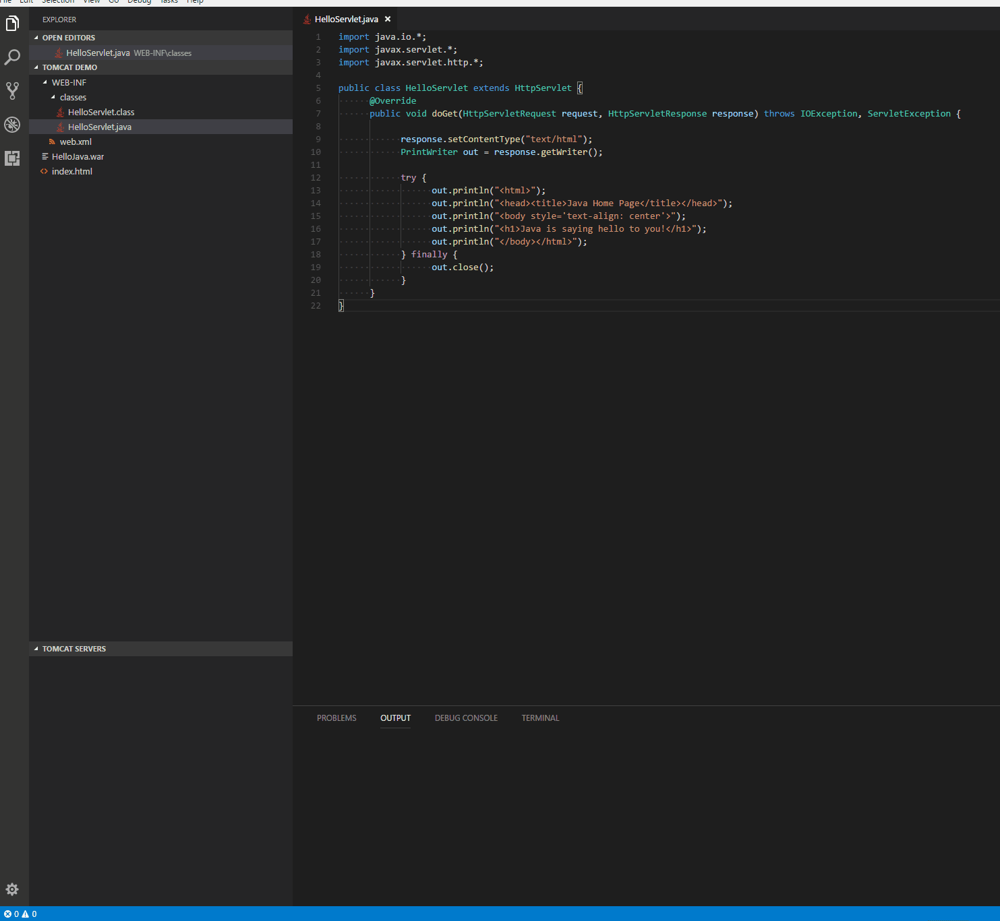

# Tomcat for Visual Studio Code

## Usage

## Features
* Add Tomcat Server from Tomcat Install Path
* Start/Restart Tomcat Server from VSCode
* Run war package on Tomcat Server
* Debug war package on Tomcat Server
* Run exploded war on Tomcat Server
* Debug exploded war on Tomcat Server
* Open server homepage in browser to check all deployed war packages
* View all deployed war packages in Tomcat Explorer
* Open war package homepage in browser
* Stop Tomcat Server
* Rename Tomcat Server
* Customize JVM Options when starting Tomcat Server
* Reveal deployed war packages in file explorer
* Delete deployed war package

## Prerequisites
* [Apache Tomcat](http://tomcat.apache.org/)
* [Debugger for Java](https://marketplace.visualstudio.com/items?itemName=vscjava.vscode-java-debug) (for debuging war package)

## Contributing

This project has adopted the [Microsoft Open Source Code of Conduct](https://opensource.microsoft.com/codeofconduct/). For more information see the [Code of Conduct FAQ](https://opensource.microsoft.com/codeofconduct/faq/) or contact [opencode@microsoft.com](mailto:opencode@microsoft.com) with any additional questions or comments.

## Release Notes
Refer to [CHANGELOG](CHANGELOG.md)

## Telemetry
VS Code collects usage data and sends it to Microsoft to help improve our products and services. Read our [privacy statement](https://go.microsoft.com/fwlink/?LinkID=528096&clcid=0x409) to learn more. If you don't wish to send usage data to Microsoft, you can set the `telemetry.enableTelemetry` setting to `false`. Learn more in our [FAQ](https://code.visualstudio.com/docs/supporting/faq#_how-to-disable-telemetry-reporting).