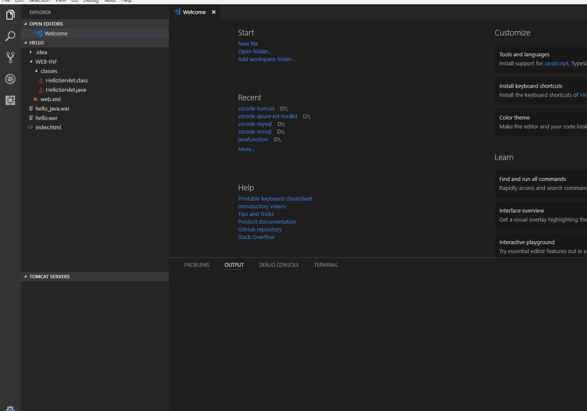
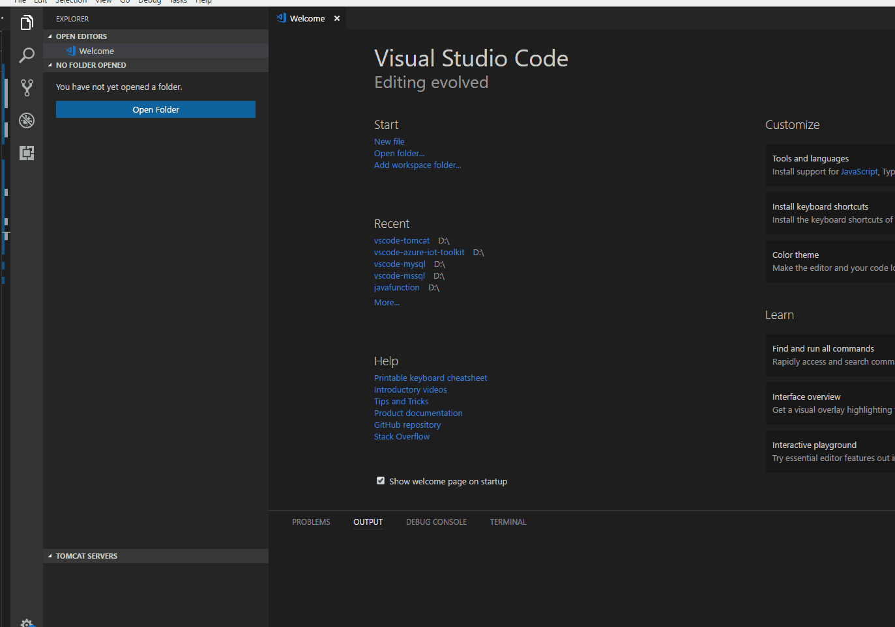

# Tomcat for Visual Studio Code

## Features
* Create Tomcat Server from Tomcat Install Path
* Start/Restart Tomcat Server from VSCode
* Run war package on Tomcat Server
* Debug war package on Tomcat Server
* Open server page in browser to check all deployed war packages
* Open war package page in browser
* Stop Tomcat Server
* Rename Tomcat Server

## Prerequisites
* [Apache Tomcat](http://tomcat.apache.org/)
* [Debugger for Java](https://marketplace.visualstudio.com/items?itemName=vscjava.vscode-java-debug) (for debuging war package)

## Usage

* Create New Tomcat Server, right-click and start it. Find a war package, right-click to run it on Tomcat Server.

* Debug war package on Tomcat Server

Right-click a war package to debug it on Tomcat Server, if there is no server ready, just create a new one.
Set a breakpoint, and trigger it.

* Rename Tomcat Server
 

## Contributing

This project has adopted the [Microsoft Open Source Code of Conduct](https://opensource.microsoft.com/codeofconduct/). For more information see the [Code of Conduct FAQ](https://opensource.microsoft.com/codeofconduct/faq/) or contact [opencode@microsoft.com](mailto:opencode@microsoft.com) with any additional questions or comments.

## Release Notes
Refer to [CHANGELOG](CHANGELOG.md)

