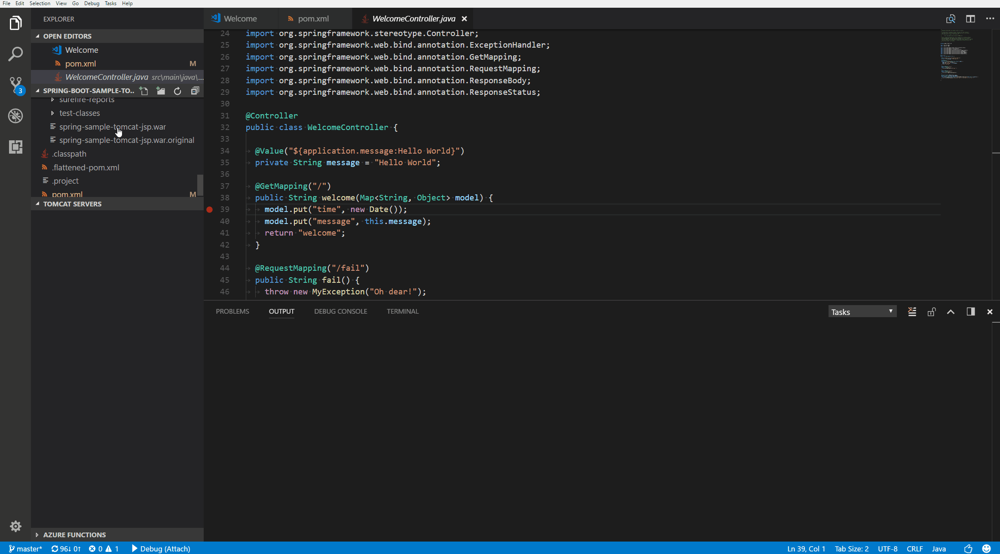

# Tomcat for Visual Studio Code

## Prerequisites
* [Apache Tomcat](http://tomcat.apache.org/)
* For debugging:
  * [Debugger for Java](https://marketplace.visualstudio.com/items?itemName=vscjava.vscode-java-debug)

## Features
* Debug/Run war package on Tomcat
* Link Tomcat into workspace

### Debug

## Release Notes
Refer to [CHANGELOG](CHANGELOG.md)

